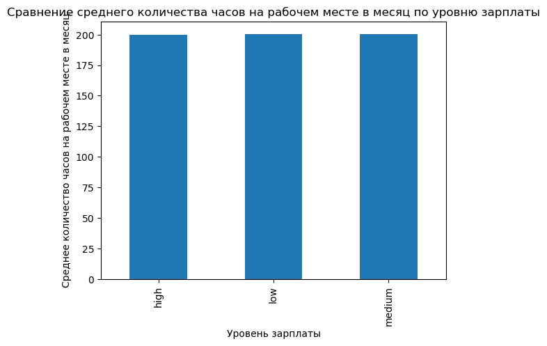

# netology_diploma

```python
import pandas as pd
import numpy as np
import seaborn as sns
import matplotlib.pyplot as plt
import plotly.figure_factory as ff
from scipy import stats
from sklearn.model_selection import train_test_split
from sklearn.discriminant_analysis import LinearDiscriminantAnalysis
from sklearn.metrics import accuracy_score
```


```python
hr_data = pd.read_csv('/Users/mac/Downloads/HR (1).csv')
hr_data.head()
```


<div>
<style scoped>
    .dataframe tbody tr th:only-of-type {
        vertical-align: middle;
    }

    .dataframe tbody tr th {
        vertical-align: top;
    }

    .dataframe thead th {
        text-align: right;
    }
</style>
<table border="1" class="dataframe">
  <thead>
    <tr style="text-align: right;">
      <th></th>
      <th>satisfaction_level</th>
      <th>last_evaluation</th>
      <th>number_project</th>
      <th>average_montly_hours</th>
      <th>time_spend_company</th>
      <th>Work_accident</th>
      <th>left</th>
      <th>promotion_last_5years</th>
      <th>department</th>
      <th>salary</th>
    </tr>
  </thead>
  <tbody>
    <tr>
      <th>0</th>
      <td>0.38</td>
      <td>0.53</td>
      <td>2</td>
      <td>157</td>
      <td>3</td>
      <td>0</td>
      <td>1</td>
      <td>0</td>
      <td>sales</td>
      <td>low</td>
    </tr>
    <tr>
      <th>1</th>
      <td>0.80</td>
      <td>0.86</td>
      <td>5</td>
      <td>262</td>
      <td>6</td>
      <td>0</td>
      <td>1</td>
      <td>0</td>
      <td>sales</td>
      <td>medium</td>
    </tr>
    <tr>
      <th>2</th>
      <td>0.11</td>
      <td>0.88</td>
      <td>7</td>
      <td>272</td>
      <td>4</td>
      <td>0</td>
      <td>1</td>
      <td>0</td>
      <td>sales</td>
      <td>medium</td>
    </tr>
    <tr>
      <th>3</th>
      <td>0.72</td>
      <td>0.87</td>
      <td>5</td>
      <td>223</td>
      <td>5</td>
      <td>0</td>
      <td>1</td>
      <td>0</td>
      <td>sales</td>
      <td>low</td>
    </tr>
    <tr>
      <th>4</th>
      <td>0.37</td>
      <td>0.52</td>
      <td>2</td>
      <td>159</td>
      <td>3</td>
      <td>0</td>
      <td>1</td>
      <td>0</td>
      <td>sales</td>
      <td>low</td>
    </tr>
  </tbody>
</table>
</div>


# Задание 2

Рассчитайте основные статистики для переменных
(среднее,медиана,мода,мин/макс,сред.отклонение).


```python
#общая статистика, переделала для удобного формата. Здесь указаны пустые значения, уникальные и общее количество.
data = pd.DataFrame()
data['uniq'] = hr_data.nunique()
data['with null'] = hr_data.isna().sum()
data['count'] = hr_data.count() - data['with null']
dtypes = hr_data.dtypes
data['type'] = dtypes
data
```


<div>
<style scoped>
    .dataframe tbody tr th:only-of-type {
        vertical-align: middle;
    }

    .dataframe tbody tr th {
        vertical-align: top;
    }

    .dataframe thead th {
        text-align: right;
    }
</style>
<table border="1" class="dataframe">
  <thead>
    <tr style="text-align: right;">
      <th></th>
      <th>uniq</th>
      <th>with null</th>
      <th>count</th>
      <th>type</th>
    </tr>
  </thead>
  <tbody>
    <tr>
      <th>satisfaction_level</th>
      <td>92</td>
      <td>0</td>
      <td>14999</td>
      <td>float64</td>
    </tr>
    <tr>
      <th>last_evaluation</th>
      <td>65</td>
      <td>0</td>
      <td>14999</td>
      <td>float64</td>
    </tr>
    <tr>
      <th>number_project</th>
      <td>6</td>
      <td>0</td>
      <td>14999</td>
      <td>int64</td>
    </tr>
    <tr>
      <th>average_montly_hours</th>
      <td>215</td>
      <td>0</td>
      <td>14999</td>
      <td>int64</td>
    </tr>
    <tr>
      <th>time_spend_company</th>
      <td>8</td>
      <td>0</td>
      <td>14999</td>
      <td>int64</td>
    </tr>
    <tr>
      <th>Work_accident</th>
      <td>2</td>
      <td>0</td>
      <td>14999</td>
      <td>int64</td>
    </tr>
    <tr>
      <th>left</th>
      <td>2</td>
      <td>0</td>
      <td>14999</td>
      <td>int64</td>
    </tr>
    <tr>
      <th>promotion_last_5years</th>
      <td>2</td>
      <td>0</td>
      <td>14999</td>
      <td>int64</td>
    </tr>
    <tr>
      <th>department</th>
      <td>10</td>
      <td>0</td>
      <td>14999</td>
      <td>object</td>
    </tr>
    <tr>
      <th>salary</th>
      <td>3</td>
      <td>0</td>
      <td>14999</td>
      <td>object</td>
    </tr>
  </tbody>
</table>
</div>


```python
#решила еще посмотреть количество дублей
duplicate_rows = hr_data.duplicated().sum()
print(f"Number of duplicate rows: {duplicate_rows}")

```

    Number of duplicate rows: 3008


Пустых значений нет. Так как satisfaction_level, last_evaluation, average_montly_hours много уникальных значений решаю проверять являются ли они неприрывными величинами.

Также из описания к датасету и датасета непостредственно мы можем понять, что к категориальным величинам у нас относятся Work_accident,	left,	promotion_last_5years,	department,	salary
Остальные количественные


```python
for col in hr_data.columns.values:
    if (len(hr_data[col].value_counts())> 5) and (hr_data[col].isnull().sum() > 0):
      print(col)

#нет, если бы являлись, то в результате работы кода их имена были бы в списке
```

Тогда я подумала, что такое количество дублей это ошибка датафрейма. Так как каждая строка это уникальный сотрудник, то не может быть такое повторение внутри датасета


```python
hr_data = hr_data.drop_duplicates().reset_index(drop=True)
hr_data.head(5)
```


<div>
<style scoped>
    .dataframe tbody tr th:only-of-type {
        vertical-align: middle;
    }

    .dataframe tbody tr th {
        vertical-align: top;
    }

    .dataframe thead th {
        text-align: right;
    }
</style>
<table border="1" class="dataframe">
  <thead>
    <tr style="text-align: right;">
      <th></th>
      <th>satisfaction_level</th>
      <th>last_evaluation</th>
      <th>number_project</th>
      <th>average_montly_hours</th>
      <th>time_spend_company</th>
      <th>Work_accident</th>
      <th>left</th>
      <th>promotion_last_5years</th>
      <th>department</th>
      <th>salary</th>
    </tr>
  </thead>
  <tbody>
    <tr>
      <th>0</th>
      <td>0.38</td>
      <td>0.53</td>
      <td>2</td>
      <td>157</td>
      <td>3</td>
      <td>0</td>
      <td>1</td>
      <td>0</td>
      <td>sales</td>
      <td>low</td>
    </tr>
    <tr>
      <th>1</th>
      <td>0.80</td>
      <td>0.86</td>
      <td>5</td>
      <td>262</td>
      <td>6</td>
      <td>0</td>
      <td>1</td>
      <td>0</td>
      <td>sales</td>
      <td>medium</td>
    </tr>
    <tr>
      <th>2</th>
      <td>0.11</td>
      <td>0.88</td>
      <td>7</td>
      <td>272</td>
      <td>4</td>
      <td>0</td>
      <td>1</td>
      <td>0</td>
      <td>sales</td>
      <td>medium</td>
    </tr>
    <tr>
      <th>3</th>
      <td>0.72</td>
      <td>0.87</td>
      <td>5</td>
      <td>223</td>
      <td>5</td>
      <td>0</td>
      <td>1</td>
      <td>0</td>
      <td>sales</td>
      <td>low</td>
    </tr>
    <tr>
      <th>4</th>
      <td>0.37</td>
      <td>0.52</td>
      <td>2</td>
      <td>159</td>
      <td>3</td>
      <td>0</td>
      <td>1</td>
      <td>0</td>
      <td>sales</td>
      <td>low</td>
    </tr>
  </tbody>
</table>
</div>


```python
hr_data[hr_data.duplicated() == True]
```


<div>
<style scoped>
    .dataframe tbody tr th:only-of-type {
        vertical-align: middle;
    }

    .dataframe tbody tr th {
        vertical-align: top;
    }

    .dataframe thead th {
        text-align: right;
    }
</style>
<table border="1" class="dataframe">
  <thead>
    <tr style="text-align: right;">
      <th></th>
      <th>satisfaction_level</th>
      <th>last_evaluation</th>
      <th>number_project</th>
      <th>average_montly_hours</th>
      <th>time_spend_company</th>
      <th>Work_accident</th>
      <th>left</th>
      <th>promotion_last_5years</th>
      <th>department</th>
      <th>salary</th>
    </tr>
  </thead>
  <tbody>
  </tbody>
</table>
</div>


Посмотрим статистики для количественных и категориальных величин


```python
# анализ количественных величин
hr_data.iloc[:,:5].describe().round(2).loc[['50%', 'mean', 'min', 'max', 'std']]
```


<div>
<style scoped>
    .dataframe tbody tr th:only-of-type {
        vertical-align: middle;
    }

    .dataframe tbody tr th {
        vertical-align: top;
    }

    .dataframe thead th {
        text-align: right;
    }
</style>
<table border="1" class="dataframe">
  <thead>
    <tr style="text-align: right;">
      <th></th>
      <th>satisfaction_level</th>
      <th>last_evaluation</th>
      <th>number_project</th>
      <th>average_montly_hours</th>
      <th>time_spend_company</th>
    </tr>
  </thead>
  <tbody>
    <tr>
      <th>50%</th>
      <td>0.66</td>
      <td>0.72</td>
      <td>4.00</td>
      <td>200.00</td>
      <td>3.00</td>
    </tr>
    <tr>
      <th>mean</th>
      <td>0.63</td>
      <td>0.72</td>
      <td>3.80</td>
      <td>200.47</td>
      <td>3.36</td>
    </tr>
    <tr>
      <th>min</th>
      <td>0.09</td>
      <td>0.36</td>
      <td>2.00</td>
      <td>96.00</td>
      <td>2.00</td>
    </tr>
    <tr>
      <th>max</th>
      <td>1.00</td>
      <td>1.00</td>
      <td>7.00</td>
      <td>310.00</td>
      <td>10.00</td>
    </tr>
    <tr>
      <th>std</th>
      <td>0.24</td>
      <td>0.17</td>
      <td>1.16</td>
      <td>48.73</td>
      <td>1.33</td>
    </tr>
  </tbody>
</table>
</div>


```python
#анализ категориальных величин (очень удобно получилось)
hr_data.iloc[:,5:10].mode()
```


<div>
<style scoped>
    .dataframe tbody tr th:only-of-type {
        vertical-align: middle;
    }

    .dataframe tbody tr th {
        vertical-align: top;
    }

    .dataframe thead th {
        text-align: right;
    }
</style>
<table border="1" class="dataframe">
  <thead>
    <tr style="text-align: right;">
      <th></th>
      <th>Work_accident</th>
      <th>left</th>
      <th>promotion_last_5years</th>
      <th>department</th>
      <th>salary</th>
    </tr>
  </thead>
  <tbody>
    <tr>
      <th>0</th>
      <td>0</td>
      <td>0</td>
      <td>0</td>
      <td>sales</td>
      <td>low</td>
    </tr>
  </tbody>
</table>
</div>


# Задание 3 

Рассчитайте и визуализировать корреляционную матрицу для
количественных переменных.
Определите две самые скоррелированные и две наименее
скоррелированные переменные.


```python
sns.heatmap(hr_data[['satisfaction_level', 'last_evaluation', 'number_project', 'average_montly_hours', 'time_spend_company']].corr(), annot = True)
```


    <Axes: >


    

    


**Результат:**

*   Наиболее скореллированные переменные: average_montly_hours и number_project: **0.33**
*   ННаименее скоррелированные переменные average_montly_hours и satisfaction_level: **-0.0063**

# Задание 4 

Рассчитайте сколько сотрудников работает в каждом
департаменте.


```python
hr_data.groupby('department').size()
```


    department
    IT              976
    RandD           694
    accounting      621
    hr              601
    management      436
    marketing       673
    product_mng     686
    sales          3239
    support        1821
    technical      2244
    dtype: int64


# Задание 5 
Показать распределение сотрудников по зарплатам. 


```python
hr_data.salary.value_counts()
```


    low       5740
    medium    5261
    high       990
    Name: salary, dtype: int64


```python
plt.figure(figsize = (7, 6))
hr_data['salary'].value_counts().plot(kind = 'bar')
plt.xlabel('Зарплата')
plt.ylabel('Количество сотрудников')
plt.title('Распределение сотрудников по зарплате')
plt.show()
```


    

    


# Задание 6
Показать распределение сотрудников по зарплатам в каждом
департаменте по отдельности


```python
hr_data.pivot_table(index='department', columns='salary', aggfunc='size')
```


<div>
<style scoped>
    .dataframe tbody tr th:only-of-type {
        vertical-align: middle;
    }

    .dataframe tbody tr th {
        vertical-align: top;
    }

    .dataframe thead th {
        text-align: right;
    }
</style>
<table border="1" class="dataframe">
  <thead>
    <tr style="text-align: right;">
      <th>salary</th>
      <th>high</th>
      <th>low</th>
      <th>medium</th>
    </tr>
    <tr>
      <th>department</th>
      <th></th>
      <th></th>
      <th></th>
    </tr>
  </thead>
  <tbody>
    <tr>
      <th>IT</th>
      <td>71</td>
      <td>476</td>
      <td>429</td>
    </tr>
    <tr>
      <th>RandD</th>
      <td>47</td>
      <td>322</td>
      <td>325</td>
    </tr>
    <tr>
      <th>accounting</th>
      <td>63</td>
      <td>296</td>
      <td>262</td>
    </tr>
    <tr>
      <th>hr</th>
      <td>38</td>
      <td>296</td>
      <td>267</td>
    </tr>
    <tr>
      <th>management</th>
      <td>128</td>
      <td>139</td>
      <td>169</td>
    </tr>
    <tr>
      <th>marketing</th>
      <td>62</td>
      <td>310</td>
      <td>301</td>
    </tr>
    <tr>
      <th>product_mng</th>
      <td>52</td>
      <td>343</td>
      <td>291</td>
    </tr>
    <tr>
      <th>sales</th>
      <td>237</td>
      <td>1553</td>
      <td>1449</td>
    </tr>
    <tr>
      <th>support</th>
      <td>126</td>
      <td>867</td>
      <td>828</td>
    </tr>
    <tr>
      <th>technical</th>
      <td>166</td>
      <td>1138</td>
      <td>940</td>
    </tr>
  </tbody>
</table>
</div>


```python
plt.figure(figsize=(15, 10))
hr_data.groupby(['department', 'salary']).size().unstack().plot(kind='bar', stacked=True)
plt.xlabel('Департамент')
plt.ylabel('Количество сотрудников')
plt.title('Распределение между департаментом и зарплатой')
plt.legend(title='Зарплата')
plt.show()
```


    <Figure size 1500x1000 with 0 Axes>


    

    


# Задание 7

Проверить гипотезу, что сотрудники с высоким окладом
проводят на работе больше времени, чем сотрудники с низким
окладом


```python
pivot_table = hr_data.pivot_table(index='salary', values='average_montly_hours', aggfunc='mean')
print(pivot_table)

pivot_table.plot(kind='bar', legend=False)
plt.xlabel('Уровень зарплаты')
plt.ylabel('Среднее количество часов на рабочем месте в месяц')
plt.title('Сравнение среднего количества часов на рабочем месте в месяц по уровню зарплаты')
plt.show()
```

            average_montly_hours
    salary                      
    high              200.067677
    low               200.439199
    medium            200.587341


    

    


Визуально разницы в рабочих часах между сотрудниками с высоким и низким окладом нет, однако проверим это с помощью проверки гипотезы Предположим, что Н_0 = в среднем проведенное на работе время одинаково для всех работников


```python
salary_low = hr_data[hr_data['salary'] == 'low']['average_montly_hours']
salary_high = hr_data[hr_data['salary'] == 'high']['average_montly_hours']

result = stats.ttest_ind(salary_low, salary_high, equal_var=False)
a = 0.05
if (result.pvalue < a):
    print('Отвергаем нулевую гипотезу')
else:
    print('Нулевая гипотеза не отвергается')
```

    Нулевая гипотеза не отвергается


Можно с уверенностью сказать, что разницы в работе между сотрудниками с маленькой и большой зарплатой нет

# Задание 8
Рассчитать следующие показатели среди уволившихся и не
уволившихся сотрудников (по отдельности):


*   Доля сотрудников с повышением за последние 5 лет

*   Средняя степень удовлетворенности
*   Среднее количество проектов


```python
promoted_left = hr_data[hr_data['left'] == 1]['promotion_last_5years'].mean()
promoted_not_left = hr_data[hr_data['left'] == 0]['promotion_last_5years'].mean()
satisfaction_left = hr_data[hr_data['left'] == 1]['satisfaction_level'].mean()
satisfaction_not_left = hr_data[hr_data['left'] == 0]['satisfaction_level'].mean()
projects_left = hr_data[hr_data['left'] == 1]['number_project'].mean()
projects_not_left = hr_data[hr_data['left'] == 0]['number_project'].mean()

```


```python
results = pd.DataFrame(columns=['Повышение за последние 5 лет', 'Уровень удовлетворенности', 'Количество проектов'])
results.loc['Ушли'] = [promoted_left, satisfaction_left, projects_left]
results.loc['Не ушли'] = [promoted_not_left, satisfaction_not_left, projects_not_left]
results
```


<div>
<style scoped>
    .dataframe tbody tr th:only-of-type {
        vertical-align: middle;
    }

    .dataframe tbody tr th {
        vertical-align: top;
    }

    .dataframe thead th {
        text-align: right;
    }
</style>
<table border="1" class="dataframe">
  <thead>
    <tr style="text-align: right;">
      <th></th>
      <th>Повышение за последние 5 лет</th>
      <th>Уровень удовлетворенности</th>
      <th>Количество проектов</th>
    </tr>
  </thead>
  <tbody>
    <tr>
      <th>Ушли</th>
      <td>0.004018</td>
      <td>0.440271</td>
      <td>3.883476</td>
    </tr>
    <tr>
      <th>Не ушли</th>
      <td>0.019500</td>
      <td>0.667365</td>
      <td>3.786800</td>
    </tr>
  </tbody>
</table>
</div>


# Задание 9

Разделить данные на тестовую и обучающую выборки
Построить модель LDA, предсказывающую уволился ли
сотрудник на основе имеющихся факторов (кроме department и
salary)
Оценить качество модели на тестовой выборки


```python
# Разделение данных на признаки (X) и целевую переменную (y)
X = hr_data.drop(['left', 'department', 'salary'], axis=1)
y = hr_data['left']
```


```python
X_train, X_test, y_train, y_test = train_test_split(X, y, test_size=0.2, random_state=42)
```


```python
# Построение модели LDA
lda = LinearDiscriminantAnalysis()
lda.fit(X_train, y_train)

# Оценка качества модели на тестовой выборке
accuracy = lda.score(X_test, y_test)
print("Accuracy:", accuracy)
```

    Accuracy: 0.830762817840767


0.83 - это высокий показатель. Значит, что модель репрезентативная

# Задание 10

https://github.com/Natadelaer/netology_diploma

